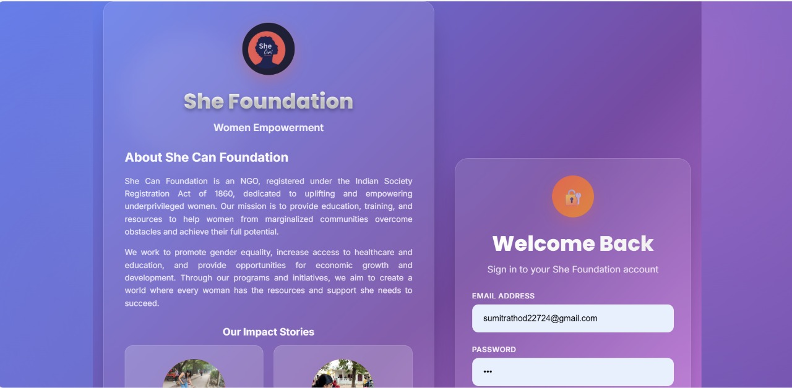
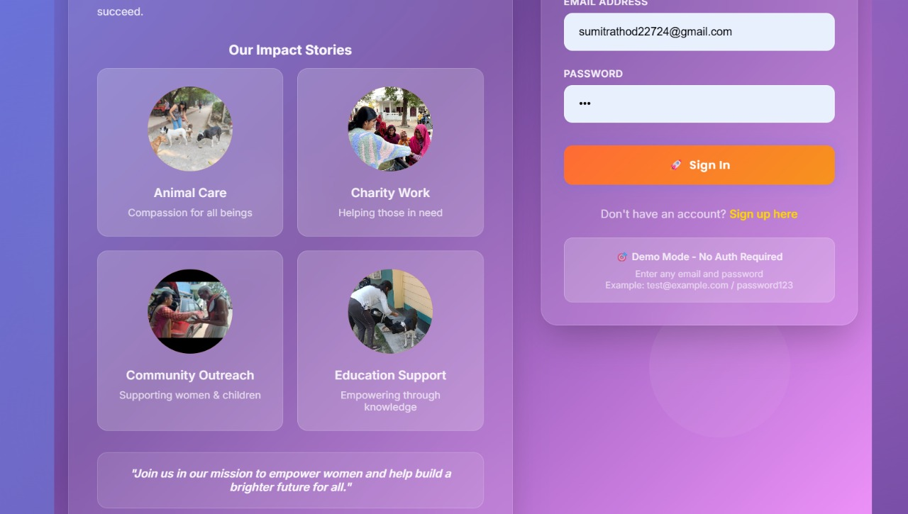
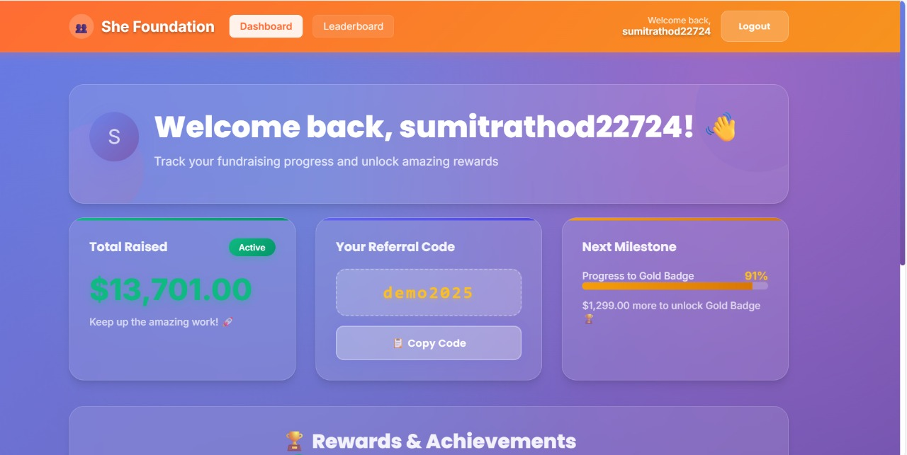
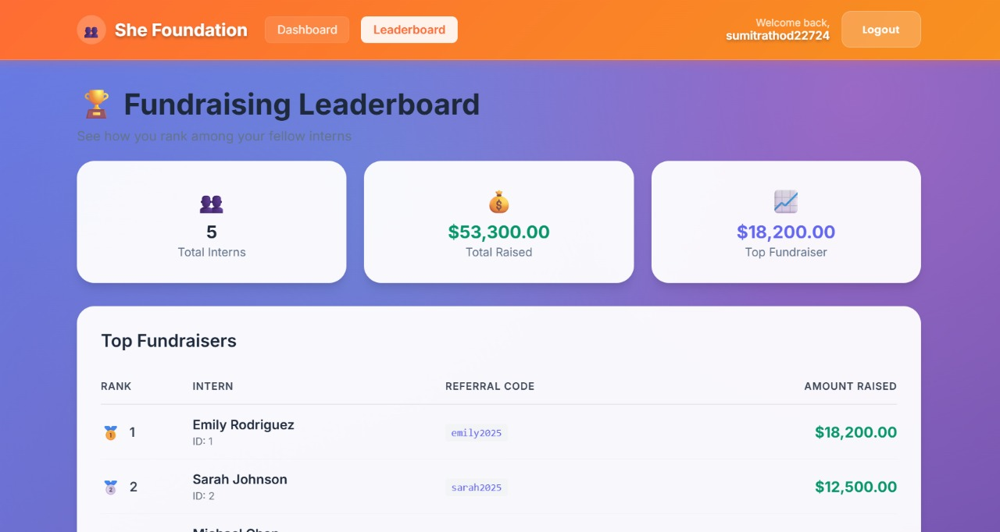

# She Foundation - Internportal

A modern, responsive web application built for She Foundation, an NGO dedicated to uplifting and empowering underprivileged women. This platform features a beautiful glass morphism design with dummy authentication and comprehensive dashboard functionality.

## 🚀 Features

### ✨ **Modern UI/UX Design**
- **Glass Morphism Effect**: Beautiful translucent cards with backdrop blur
- **Gradient Backgrounds**: Purple gradient theme throughout the application
- **Responsive Design**: Works seamlessly on desktop, tablet, and mobile devices
- **Smooth Animations**: Floating elements and pulse animations for enhanced user experience

### 🔐 **Authentication System**
- **Dummy Authentication**: No backend required - accepts any email/password combination
- **Demo Mode**: Clearly indicated with helpful instructions
- **User Registration**: Complete signup form with validation
- **Session Management**: Maintains user state across the application

### 📊 **Dashboard Features**
- **Personalized Welcome**: Dynamic user greeting with username
- **Fundraising Progress**: Real-time tracking of total raised amount
- **Referral System**: Unique referral codes for each user
- **Milestone Tracking**: Progress towards achievement badges
- **Rewards System**: Bronze, Silver, and Gold badges based on fundraising goals

### 🏆 **Leaderboard System**
- **Competitive Rankings**: See how you rank among fellow fundraisers
- **Total Statistics**: Overview of all participants and total funds raised
- **Individual Profiles**: Detailed view of top performers

### 🎨 **Visual Impact Stories**
- **Image Gallery**: Showcasing foundation's work through beautiful imagery
- **Impact Categories**: Animal Care, Charity Work, Community Outreach, Education Support
- **Mission Statement**: Clear communication of foundation's goals

## 📸 Screenshots

### Login Page

*Beautiful login interface with glass morphism design and impact stories gallery*

### Signup Page  

*Complete registration form with foundation information and mission statement*

### Dashboard

*Personalized dashboard showing fundraising progress, referral codes, and achievements*

### Leaderboard

*Competitive leaderboard displaying top fundraisers and overall statistics*

## 🛠️ Technology Stack

### **Frontend**
- **React.js**: Modern UI framework for building interactive components
- **React Router**: Client-side routing for seamless navigation
- **CSS-in-JS**: Inline styles for dynamic theming and animations
- **Glass Morphism**: Modern design technique with backdrop blur effects

### **Backend** (Optional)
- **Node.js**: Server-side JavaScript runtime
- **Express.js**: Web application framework
- **MongoDB**: NoSQL database for user data
- **JWT**: JSON Web Tokens for authentication

## 🚀 Quick Start

### **Prerequisites**
- Node.js (v14 or higher)
- npm or yarn package manager

### **Installation**

1. **Clone the repository**
   ```bash
   git clone https://github.com/Sumit-ops357/She_Foundation_Assignment.git
   cd She_Foundation_Assignment
   ```

2. **Install dependencies**
   ```bash
   # Install client dependencies
   cd client
   npm install
   
   # Install server dependencies (optional)
   cd ../server
   npm install
   ```

3. **Start the application**
   ```bash
   # Start frontend only (recommended for demo)
   cd client
   npm start
   
   # Or start with backend (optional)
   cd ../server
   npm run dev
   ```

4. **Access the application**
   - Frontend: http://localhost:3000
   - Backend: http://localhost:5000 (if running)

## 🎯 Demo Credentials

Since this is a demo application, you can use any email and password combination:

- **Email**: `test@example.com` (or any email)
- **Password**: `password123` (or any password)

The application will accept any valid email/password format and create a dummy user session.

## 📁 Project Structure

```
SheFoundation/
├── client/                 # React frontend application
│   ├── public/            # Static assets
│   │   ├── images/        # Project images (Image1-5.jpg)
│   │   └── index.html     # Main HTML file
│   ├── src/               # Source code
│   │   ├── components/    # React components
│   │   │   ├── Login.js   # Login page component
│   │   │   ├── Signup.js  # Signup page component
│   │   │   ├── Dashboard.js # Dashboard component
│   │   │   ├── Leaderboard.js # Leaderboard component
│   │   │   └── Navbar.js  # Navigation component
│   │   ├── App.js         # Main app component
│   │   └── index.js       # Entry point
│   └── package.json       # Frontend dependencies
├── server/                # Node.js backend (optional)
│   ├── config/           # Database configuration
│   ├── models/           # MongoDB models
│   ├── routes/           # API routes
│   └── index.js          # Server entry point
├── screenshots/          # Project screenshots
├── README.md            # Project documentation
└── .gitignore          # Git ignore rules
```

## 🎨 Design Features

### **Color Palette**
- **Primary Gradient**: Purple to pink gradient (`#667eea → #764ba2 → #f093fb`)
- **Accent Colors**: Orange (`#ff6b35`), Green (`#10b981`), Yellow (`#fbbf24`)
- **Text Colors**: White and light gray for optimal readability

### **Typography**
- **Font Family**: Poppins (Google Fonts)
- **Font Weights**: 400 (regular), 600 (semibold), 700 (bold), 800 (extrabold)
- **Responsive Sizing**: Scales appropriately across different screen sizes

### **Animations**
- **Floating Elements**: Subtle floating animations for background elements
- **Pulse Effects**: Gentle pulsing for interactive elements
- **Smooth Transitions**: 0.3s ease transitions for all interactive elements

## 🔧 Customization

### **Adding New Images**
1. Place new images in `client/public/images/`
2. Update component references to use new image paths
3. Ensure images are optimized for web (recommended: 120px x 120px for circular images)

### **Modifying Colors**
- Update gradient values in component styles
- Modify accent colors for different themes
- Adjust transparency values for glass morphism effects

### **Adding New Features**
- Create new components in `client/src/components/`
- Update routing in `App.js` for new pages
- Add new API endpoints in server (if using backend)

## 🚀 Deployment

### **Frontend Only (Recommended)**
```bash
# Build for production
cd client
npm run build

# Deploy build folder to any static hosting service
# (Netlify, Vercel, GitHub Pages, etc.)
```

### **Full Stack Deployment**
1. **Backend**: Deploy to Render, Heroku, or AWS
2. **Frontend**: Deploy to static hosting service
3. **Database**: Set up MongoDB Atlas or local database
4. **Environment Variables**: Configure API endpoints and database connections

## 🤝 Contributing

1. Fork the repository
2. Create a feature branch (`git checkout -b feature/AmazingFeature`)
3. Commit your changes (`git commit -m 'Add some AmazingFeature'`)
4. Push to the branch (`git push origin feature/AmazingFeature`)
5. Open a Pull Request

## 📝 License

This project is created for educational and demonstration purposes. The design and functionality are inspired by modern web development practices and are intended to showcase frontend development skills.

## 👨‍💻 Developer

**Sumit Rathod**
- GitHub: [@Sumit-ops357](https://github.com/Sumit-ops357)
- Project: She Foundation Assignment

---

**Built with ❤️ for women empowerment and modern web development** 